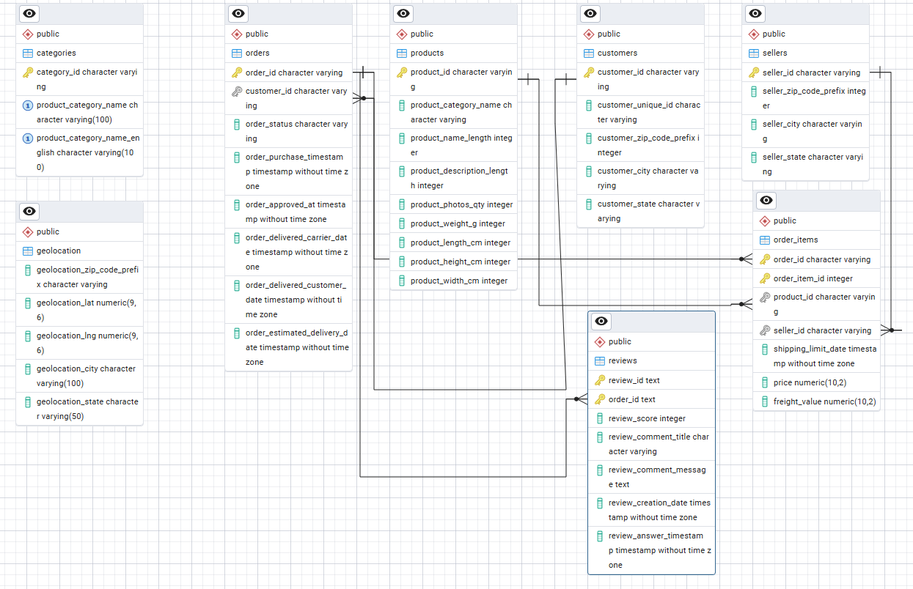
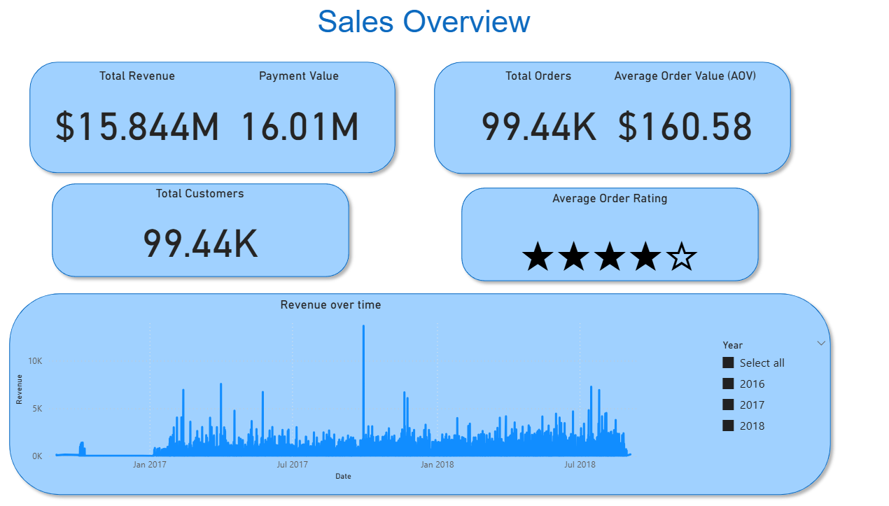
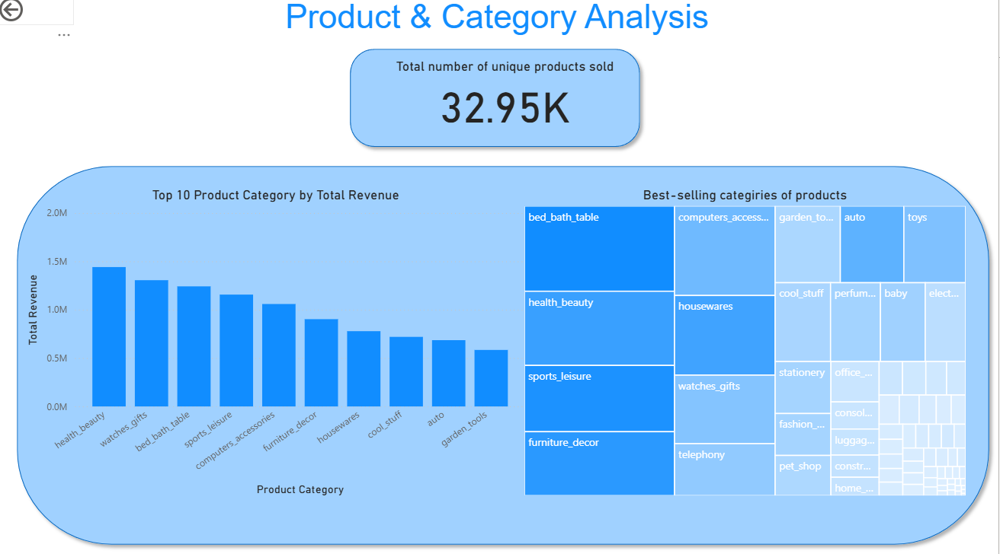
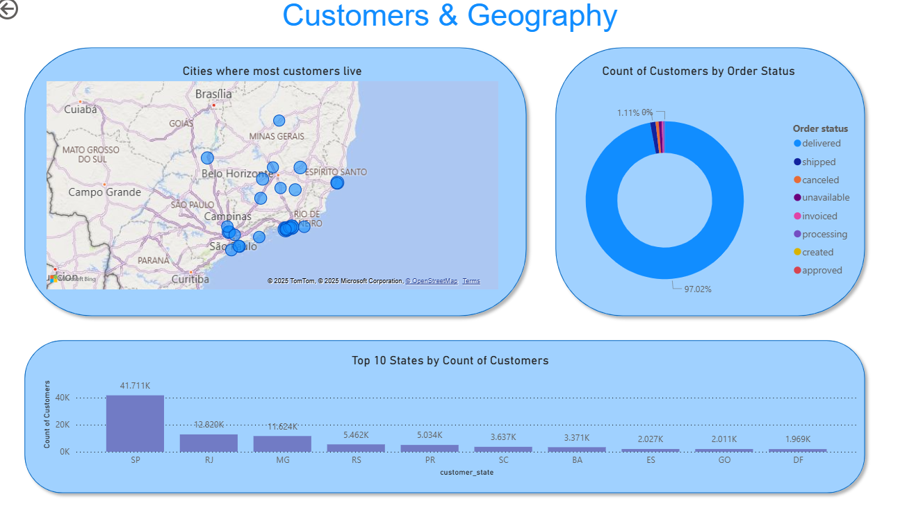

# 🛒 E-commerce Data Analysis with SQL & Power BI

## 📌 Project Overview

This project demonstrates **SQL** and **Power BI** skills by analyzing a real-world E-commerce dataset. The goal was to design a relational database, clean and wrangle the data with SQL, and create an interactive Power BI dashboard that delivers actionable business insights.

The analysis focuses on:

- Sales & revenue trends

- Product category performance

- Customer distribution & order behavior

- Geographic insights

---

## 📂 Dataset

The dataset is sourced from [Kaggle’s Brazilian E-commerce dataset](https://www.kaggle.com/datasets/abdelrahmanalimo/e-commerce-dataset/data), containing 9 CSV files with millions of records:

- customers.csv – Customer demographic & location data

- sellers.csv – Information about sellers

- products.csv – Product details (categories, dimensions, weight)

- orders.csv – Order lifecycle timestamps & status

- order_items.csv – Details of products within each order

- order_payments.csv – Payment methods & values

- reviews.csv – Customer review scores & comments

- geolocation.csv – Latitude/longitude by zip code prefix

- categories.csv – Mapping of product categories

---

## 🗄️ [Database Schema (PostgreSQL)](schema.sql)

I designed a PostgreSQL relational schema with primary/foreign keys  to structure the dataset. It containes relationships between customers, orders, products, and payments.

Relationships:

Orders ↔ Customers

Orders ↔ Payments

Order Items ↔ Orders ↔ Products ↔ Sellers

Products ↔ Categories

Customers & Sellers ↔ Geolocation

---

## 🧹 [SQL Data Wrangling & Cleaning](data-wrangling-sql.md)

Data Cleaning Steps:

1. Checking duplicates in customers, orders, products.
2. Handling missing values.
3. Validating foreign keys.
4. Outlier detection.
5. Creating clean views and views for joining multiple tables.

---

## 📊 Power BI Dashboard

I built the Power BI dashboard with multiple pages to cover sales, products, and customers.

### 1️⃣ Sales Overview

- Total Revenue: $15.8M
- Total Orders: 99.4K (with an Average Order Value of $160.58)
- Total Customers: 99.4K
- Payments: $16.0M total value processed
- Customer Satisfaction: Average order rating close to 4 out of 5 stars

*Finding:* Revenue shows growth from 2016 to 2018, with noticeable seasonal spikes (likely tied to sales events).

### 2️⃣ Product & Category Analysis

- Unique Products Sold: 32.9K
- Top 3 Categories by Revenue:
   - Health & Beauty
   - Watches & Gifts
   - Bed, Bath & Table
- The best selling categories are slightly different:
   - Health & Beauty
   - Bed, Bath & Table
   - Sport & Leisure

Finding: Sales are highly concentrated in a few categories, with long-tail categories contributing less revenue. This suggests opportunities for targeted promotions in mid-performing categories.

### 3️⃣ Customers & Geography

- Top Customer States: São Paulo (SP), Minas Gerais (MG), Rio de Janeiro (RJ)
- Customer Order Status: 98% orders successfully delivered

Finding: Customer base is concentrated in urban centers. Expansion into underrepresented states could increase market share.

---

## 🔑 Key Findings

- Revenue exceeded $15M across ~100K orders, showing strong market demand.

- Product sales follow a Pareto pattern: a few categories dominate revenue.

- Geographic analysis highlights dependence on São Paulo region and offers growth opportunities outside SP/MG/RJ.

- High delivery success and strong customer ratings (4★) indicate customer satisfaction, but review analysis could identify improvement areas.

---

## ⚙️ Tools & Technologies Used

- **PostgreSQL** – Data wrangling, joins, cleaning, schema design.
- **Power BI** – Dashboard creation, DAX calculated columns, visualization.
- **SQL + DAX** – Data modeling and transformations.