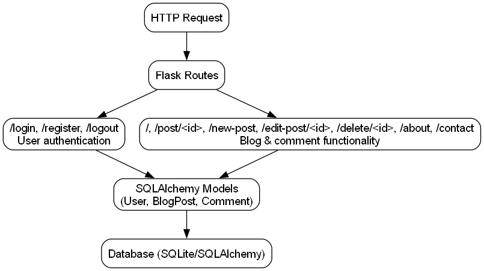
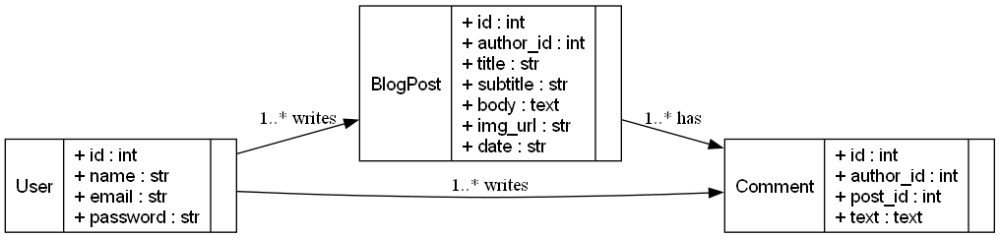
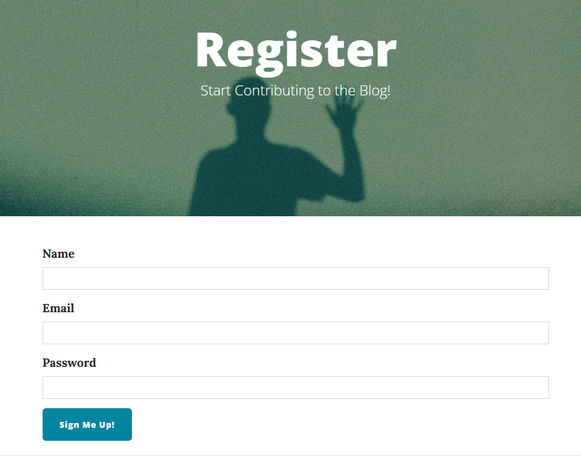
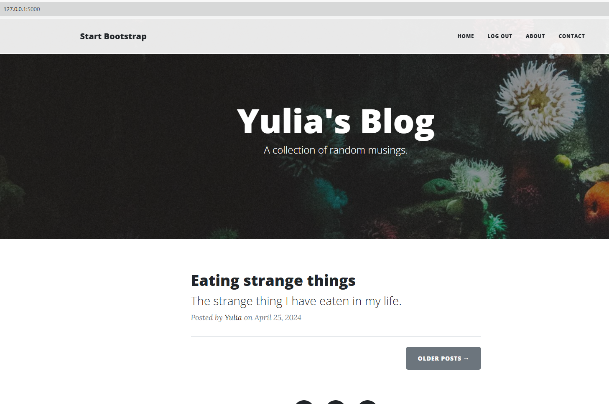
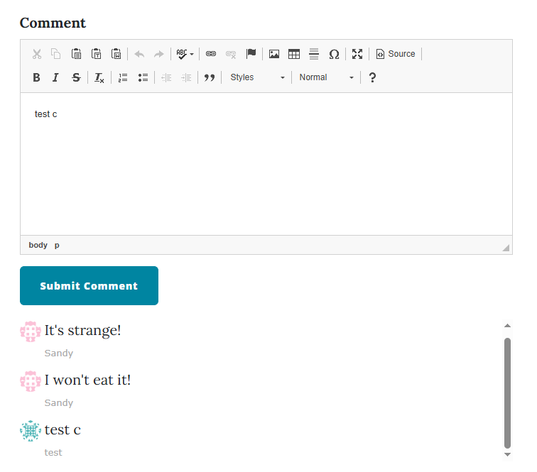

# Python Blog

A full-featured **Python Flask blog website** with **SQLite** database. Users can register, log in, comment on posts, and admins can create, edit, or delete posts. The app uses **CKEditor** for rich text editing, **Bootstrap 5** for responsive design, and **Gravatar-style avatars** for comments.

[GitHub Repository](https://github.com/YuliaAsIs/python-blog)

 
 

---

## Features

- User registration and login with hashed passwords
- Admin-only post creation, editing, and deletion
- Commenting system with avatars
- Rich text post editing via CKEditor
- Responsive UI using Bootstrap 5
- Database relationships between users, posts, and comments
- Default database: SQLite (configurable via environment variable)
- Role-based access control with Flask-Login

---

## Technologies

- Python 3  
- Flask  
- SQLAlchemy (SQLite)  
- Flask-Login  
- Flask-Bootstrap5  
- Flask-CKEditor  
- HTML, CSS, JavaScript  

## Overview of main.py

The `main.py` file is the **core of the application**. It handles:  

1. **Flask app setup and configuration**  
   - Configures `SECRET_KEY` and database URI (`SQLALCHEMY_DATABASE_URI`)
2. **Database models using SQLAlchemy**  
   - `User`: stores registered users  
   - `BlogPost`: stores blog posts with relationships to authors  
   - `Comment`: stores comments with references to posts and users  
3. **Flask-Login setup**  
   - User session management, login/logout routes, admin-only decorator  
4. **Routes for the web app**  
   - `/` – Homepage showing all posts  
   - `/post/<id>` – Single post page with comments  
   - `/new-post`, `/edit-post/<id>`, `/delete/<id>` – Admin-only post management  
   - `/login`, `/register`, `/logout` – User authentication  
   - `/about` and `/contact` – Static pages  
5. **Additional features**  
   - Rich text editing with CKEditor  
   - Bootstrap 5 for styling  
   - User avatars using Gravatar  
   - Password hashing with Werkzeug  

## main.py Flow Diagram

- Routes handle requests, interact with **models**, and render templates  
- Admin-only decorator protects `/new-post`, `/edit-post/<id>`, `/delete/<id>`  
- CKEditor and Bootstrap are applied in templates for styling and rich text

## Database ER Diagram

- **User → BlogPost:** One user can create many posts  
- **User → Comment:** One user can write many comments  
- **BlogPost → Comment:** One post can have many comments  

## Screenshots

## Author

Yulia Borodulina

[LinkedIn](https://www.linkedin.com/in/yulia-borodulina/)

[GitHub](https://github.com/YuliaAsIs)
